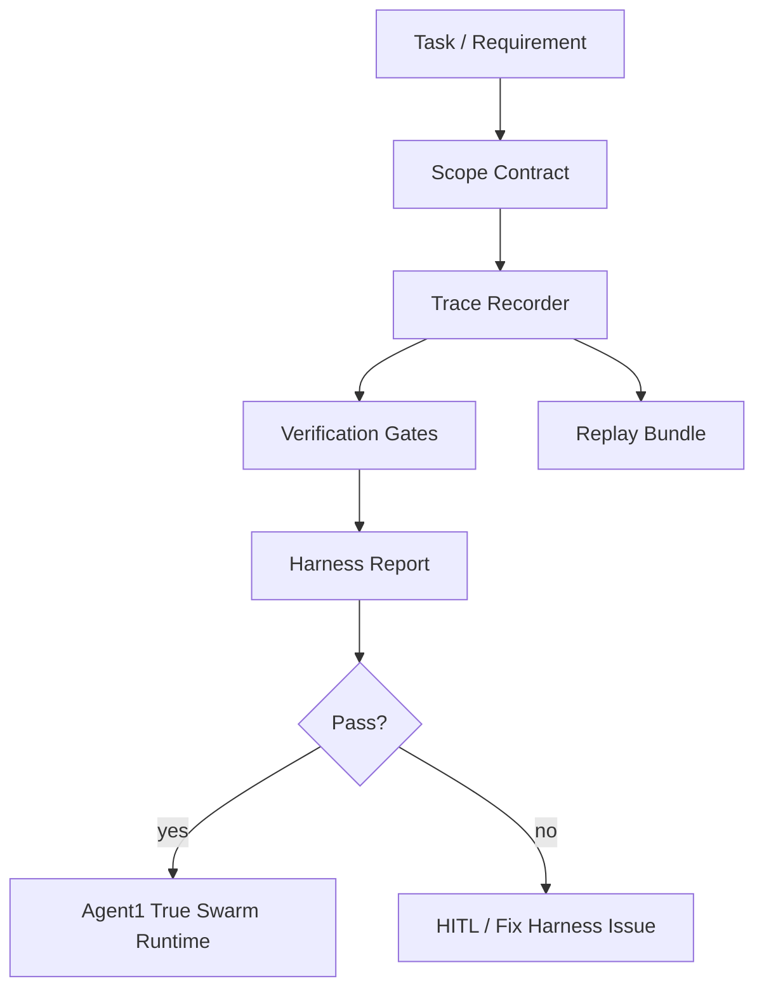

# CoreWeaver Harness Architecture

## Intent
This repo follows harness engineering: build the environment, contracts, feedback loops, and guardrails before building the swarm core.

## Current Boundary
- `studio/`: existing React/FastAPI web shell.
- `document/`: local AI/agent engineering references.
- `src/`: source root for project internals and core packages.
- `src/coreweaver/harness/`: new framework for contracts, trace, gates, replay, scope, and architecture rules.
- `src/coreweaver/api.py`: public adapter boundary for Studio.
- `src/coreweaver/contracts/`: stable plug-in contracts for Studio/Core boundaries.
- `src/coreweaver/messages/`, `events/`, `runtime/`, `hooks/`, `models/`, `tools/`, `orchestration/`, `safety/`, `debug/`: framework-first rails for the future Agent1 core.
- `src/coreweaver/run_profiles.py`: selectable runtime profiles for local skeleton, mock swarm, local LLM, and CI.
- `benchmarks/`: public smoke/mutation benchmark cases for Agent1 true swarm.
- `_private/plans/`: local-only plans, ignored by Git.

## Layer Rule
Each domain should move forward through predictable layers:

```text
types -> config -> repo -> service -> runtime -> ui
providers -> any layer
```

Cross-domain or backward dependencies must be rejected by structural tests before agent core logic grows.

## Harness Flow



## What Exists Now
- Strict-ish stdlib data contracts.
- Scope checker.
- Layered architecture checker.
- Trace/debug issue recorder.
- Gate runner.
- Secret scanner.
- Replay bundle writer.
- Knowledge/docs inventory checker.
- JSONL observability sink.
- Benchmark runner that executes Agent1 smoke/mutation cases through `mock_swarm`.
- Harness self-check CLI.
- Skeleton core boundary, config, artifact layout, registry, mock LLM, benchmark runner.
- Studio adapter to new core skeleton and Agent1 true swarm profiles.
- Message-first CoreWeaver framework packages with async event stream, hook chain, bounded loop, scheduler, model/tool adapters, safety contracts, and context/replay invariants.
- Studio/Agent1 contract and run profiles.
- Unit tests for negative cases.
- Source-layout guard rule that blocks root-level core package drift.
- Agent1 true swarm first pass: intake, clarification, Principal topology, 7 Middle groups, 24 Leaf experts, model adapter calls, blackboard writes, challenge hard cap, read-only verifier, architecture plan synthesis, signoff gates, Agent2 handoff gate, trace/replay artifacts.

## What Does Not Exist Yet
- Datasheet-backed private benchmark suite.
- Deep structured-output parsing from real `local_llm` providers.
- Agent2 execution after handoff.
