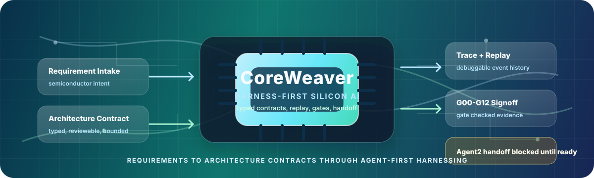
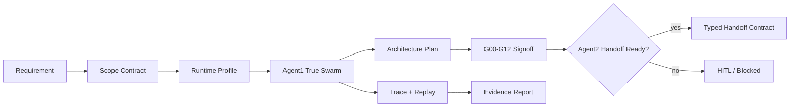

<div align="center">



[](https://github.com/TuanDanny/CoreWeaver/actions/workflows/harness.yml)


<br>


**CoreWeaver turns semiconductor requirements into typed, traceable, replayable architecture contracts before downstream RTL work is allowed to proceed.**

<a href="#quick-start"><strong>Quick Start</strong></a>
&nbsp;|&nbsp;
<a href="#architecture"><strong>Architecture</strong></a>
&nbsp;|&nbsp;
<a href="#studio"><strong>Studio</strong></a>
&nbsp;|&nbsp;
<a href="#verification-gates"><strong>Verification Gates</strong></a>
&nbsp;|&nbsp;
<a href="#repository-map"><strong>Repository Map</strong></a>

</div>

---

## Mission

CoreWeaver is a harness-first semiconductor architecture workflow. It builds the contracts, gates, traces, replay bundles, safety rails, and Studio integration first, then lets agent depth grow behind those boundaries.

The current system focuses on **Agent1 architecture planning**. Agent2 RTL execution is intentionally blocked unless Agent1 produces a ready handoff backed by passing signoff evidence.

<table>
  <tr>
    <td><strong>Input</strong></td>
    <td>Semiconductor architecture requirement</td>
  </tr>
  <tr>
    <td><strong>Runtime</strong></td>
    <td>Deterministic <code>mock_swarm</code> or optional <code>local_llm</code></td>
  </tr>
  <tr>
    <td><strong>Output</strong></td>
    <td>Architecture plan, signoff certificate, replay bundle, trace validation, Agent1-to-Agent2 handoff contract</td>
  </tr>
  <tr>
    <td><strong>Default gate</strong></td>
    <td>Typed artifacts, no secrets, benchmark evidence policy, G00-G12 signoff, handoff readiness</td>
  </tr>
</table>

## Status Board

| Area | Status | Notes |
| --- | --- | --- |
| Framework-first rails | Ready | Messages, events, hooks, bounded loop, adapters, safety, replay, and Studio shell exist. |
| Agent1 true swarm | Active | Principal topology, 7 Middle groups, 24 Leaf experts, challenge review, verifier, synthesis, signoff. |
| Public benchmarks | Ready | 20 deterministic smoke/mutation cases run credential-free through `mock_swarm`. |
| Studio shell | Active | FastAPI backend plus Vite React frontend for local cockpit workflows. |
| Live LLM quality | Optional | Routed through adapters; fake-client tests are the default acceptance path. |
| Agent2 RTL execution | Future | Blocked until Agent1 handoff readiness and signoff gates pass. |

## Architecture



### Core Principles

| Principle | Meaning |
| --- | --- |
| Harness before core | Contracts, trace, replay, safety, and gates come before deeper reasoning. |
| Package-shaped internals | Core, agents, tools, adapters, safety, debug, and benchmarks stay isolated under `src/`. |
| Adapter-only providers | Agents never call model providers directly; access flows through model/tool adapters. |
| Gate-checked outputs | Every agent output must be typed, traceable, replayable, and reviewable. |
| No secret drift | Credentials, private plans, generated outputs, and local settings stay out of Git. |

## What CoreWeaver Produces

| Artifact | Purpose |
| --- | --- |
| `reports/architecture_plan.md` | Human-readable architecture plan. |
| `contracts/agent1_to_agent2.json` | Typed handoff contract for downstream consumers. |
| `artifacts/agent1_evidence_report.json` | Machine-readable readiness and evidence verdict. |
| `artifacts/agent1_evidence_report.md` | Reviewer-friendly evidence summary. |
| `trace/*.jsonl` | Replayable event stream and lifecycle evidence. |
| `replay/` | Resume state, checkpoints, signoff, handoff, and debug artifacts. |

## Quick Start

```powershell
git clone https://github.com/TuanDanny/CoreWeaver.git
cd CoreWeaver

python -m pip install --upgrade pip
python -m pip install -e .
python -m pip install pytest pydantic fastapi httpx python-multipart

python -m pytest -q tests
```

Run the public harness gates:

```powershell
python -m pytest -q tests
python scripts/harness_check.py --json
python scripts/run_benchmarks.py --cases benchmarks/cases --json
```

## Studio

CoreWeaver Studio is the local cockpit for running and inspecting the workflow.

```powershell
studio\run_studio.bat
```

| Service | URL |
| --- | --- |
| Backend API | `http://127.0.0.1:8000` |
| Frontend | `http://127.0.0.1:5173` |
| Jobs API | `http://127.0.0.1:8000/api/jobs` |
| Run WebSocket | `ws://127.0.0.1:8000/ws/runs/current` |

Studio stays a shell. Core logic remains behind the public `coreweaver` package boundary.

## Optional Gemini Setup

Live LLM credentials are not required for normal tests or benchmarks. For local provider experiments, keep secrets outside Git.

```powershell
$env:GEMINI_API_KEY = ""
$env:COREWEAVER_MODEL_ENDPOINT = "https://generativelanguage.googleapis.com/v1beta/openai"
$env:COREWEAVER_MODEL = "gemini-flash-latest"
python scripts/gemini_smoke_test.py
```

Ignored local-only paths include `codex_api.local.json`, `.env`, `.swarm/`, `outputs/`, `runs/`, and `_private/`.

## Verification Gates

| Gate | Command |
| --- | --- |
| Python regression suite | `python -m pytest -q tests` |
| Harness policy and secret scan | `python scripts/harness_check.py --json` |
| Public benchmark evidence policy | `python scripts/run_benchmarks.py --cases benchmarks/cases --json` |
| Studio frontend smoke | `npm run test --prefix studio/frontend` |
| Studio frontend build | `npm run build --prefix studio/frontend` |

The GitHub `harness` workflow runs the core gates on pull requests and pushes.

## Repository Map

```text
CoreWeaver
|-- .github/                 GitHub workflows, templates, and ownership
|-- .rules/                  Machine-readable harness and safety rules
|-- benchmarks/              Public deterministic benchmark cases
|-- docs/                    Architecture, design, governance, and AI context
|-- document/                Local learning and reference material
|-- scripts/                 Harness, benchmark, smoke, and workflow scripts
|-- src/coreweaver/          Core framework, Agent1, adapters, safety, debug
|-- studio/                  FastAPI + Vite React local cockpit
|-- tests/                   Regression, harness, replay, signoff, Studio tests
`-- _private/plans/          Local-only private plans, ignored by Git
```

Recommended reading order:

1. [`AGENTS.md`](AGENTS.md)
2. [`docs/AI_CONTEXT.md`](docs/AI_CONTEXT.md)
3. [`ARCHITECTURE.md`](ARCHITECTURE.md)
4. [`docs/HARNESS_ENGINEERING.md`](docs/HARNESS_ENGINEERING.md)
5. [`docs/REPO_MAP.md`](docs/REPO_MAP.md)

## Development Contract

- Work on `codex/*` branches, not directly on `main`.
- Keep internals under `src/`.
- Keep model and tool calls behind adapters.
- Never commit private plans, credentials, generated outputs, Studio build output, or local settings.
- Update `session-handoff.md` for task handoff.
- Run the required gates before publishing a branch.

## Project Documents

| Document | Purpose |
| --- | --- |
| [`CONTRIBUTING.md`](CONTRIBUTING.md) | Branch, test, review, and safety expectations. |
| [`SECURITY.md`](SECURITY.md) | Security reporting and secret-handling policy. |
| [`CODE_OF_CONDUCT.md`](CODE_OF_CONDUCT.md) | Collaboration expectations. |
| [`docs/HARNESS_ENGINEERING.md`](docs/HARNESS_ENGINEERING.md) | Harness doctrine and done definition. |
| [`docs/REPO_MAP.md`](docs/REPO_MAP.md) | Current package and test coverage map. |

## License

No public license has been selected yet. All rights are reserved until the repository owner adds a license.
