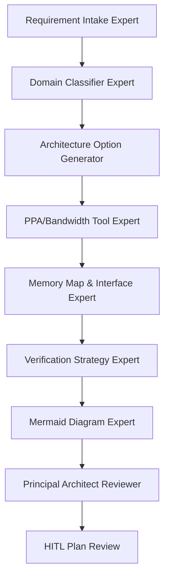
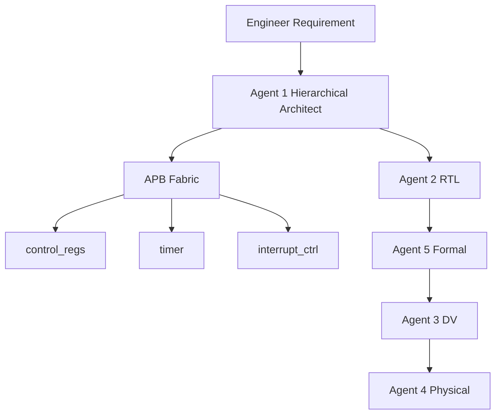
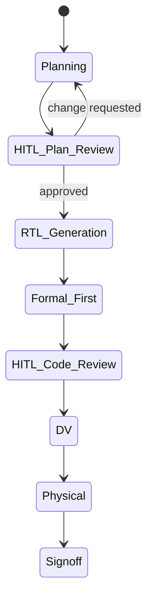

# Agent 1 Upgrade Tasks — Planning Phase

> Principal System Architect review. Scope: planning only. Do not modify production code until Chief Engineer approval.

## 0. Scope / Non-Goals

- Upgrade Agent 1 planning quality before broader swarm upgrade.
- Preserve downstream contracts for Agent 2/3/4/5 unless explicitly approved.
- Preserve locked APB slave pinout rule.
- Preserve HITL pause/resume behavior.
- Do not silently fallback to weak rule-based architecture if required Codex endpoint is unavailable.
- Do not edit historical generated output folders as source of truth; use them only as evidence of current behavior.

## 1. Audit Summary

### Files reviewed

- `main.py`
- `start_swarm.bat`
- `semiconductor_swarm/agents/agent1_planning/architect.py`
- `semiconductor_swarm/agents/agent1_planning/agent1_prompt.py`
- `semiconductor_swarm/swarm_graph.py`
- `swarm_out/reports/architecture_plan.md`
- `../test/reports/architecture_plan.md`

### Key findings

- `main.py` defaults `--project-name` to `iot_camera`; this leaks into specs and generated filenames when `.bat` does not pass project name.
- `start_swarm.bat` asks only for requirement and output directory. It does not ask for or pass project identity.
- `semiconductor_swarm/agents/agent1_planning/architect.py` is deterministic and regex/rule-based. It does not use LLM reasoning despite Agent 1 prompt existing.
- `semiconductor_swarm/agents/agent1_planning/agent1_prompt.py` defines role/rules, with hierarchical planning logic under `semiconductor_swarm/agents/agent1_planning/`.
- `semiconductor_swarm/swarm_graph.py` has one `agent1_architect` node; no hierarchical Agent 1 subgraph exists.
- `architecture_plan.md` uses ASCII diagram in a `text` fence and has no state diagram.
- Existing reports show stale `Project: iot_camera`, proving project identity is not dynamic from `.bat`.

## 2. Problem A — Remove hardcoded `iot_camera`, make project identity 100% dynamic

### Goal

Project name, output directory, checkpoint database, thread ID, top module, generated RTL, DV, formal, FPGA collateral, report names, and summary text must derive from user input or sanitized dynamic defaults, not hardcoded `iot_camera`.

### Tasks

- [x] A1. Add project-name input prompt to `start_swarm.bat`.
- [x] A2. Add RTL-safe project-name sanitizer policy:
  - lowercase preferred,
  - replace invalid chars with `_`,
  - must start with letter or `_`,
  - no spaces,
  - no Windows path separators,
  - no reserved names.
- [x] A3. Pass `--project-name "%PROJECT%"` from `.bat` in all flows:
  - initial run,
  - plan resume,
  - plan change,
  - code review resume,
  - reject path.
- [x] A4. Change `main.py` project behavior:
  - remove default `iot_camera`, or
  - derive explicit safe default from requirement/output dir with clear terminal echo.
- [x] A5. Ensure `thread-id` remains stable and unique; recommended format:
  - `%PROJECT%:%OUT%`, or
  - sanitized `%OUT%` path if backward compatibility required.
- [x] A6. Ensure generated top module uses dynamic project name: `<project>_top`.
- [x] A7. Ensure Agent 3 DV scripts use dynamic top module, not `iot_camera_top`.
- [x] A8. Ensure Agent 4 QPF/QSF/SDC uses dynamic project name.
- [x] A9. Ensure launcher scripts use dynamic project name.
- [x] A10. Add source scan test that fails if new source defaults to `iot_camera` outside tests/fixtures/historical outputs.
- [x] A11. Add end-to-end test using `thermal_sensor` proving generated outputs contain no `iot_camera`.

### Acceptance criteria

- [x] Running `.bat` with project `thermal_sensor` creates `thermal_sensor_top.sv`, `thermal_sensor.qsf`, `thermal_sensor.sdc`.
- [x] `reports/architecture_plan.md` says `Project: thermal_sensor`.
- [x] New generated output tree contains zero unintended `iot_camera` strings.
- [x] Existing tests updated to use explicit project name where `iot_camera` is intentional fixture data.

## 3. Problem B — Force Agent 1 to use Codex API

### Goal

Agent 1 must use Codex API model `cx/gpt-5.5` via OpenAI-compatible endpoint `http://localhost:20128/v1` for architecture reasoning/spec drafting. Deterministic tools remain mandatory for numeric PPA and bandwidth.

### Required configuration

```yaml
agent1_llm:
  provider: openai_compatible
  base_url: http://localhost:20128/v1
  model: cx/gpt-5.5
  timeout_s: 120
  temperature: 0.2
  max_retries: 2
```

### Tasks

- [x] B1. Add Agent 1 LLM config in repo, preferably `semiconductor_swarm/agents/agent1_config.py` or `configs/agent1_codex.json`.
- [x] B2. Add `semiconductor_swarm/agents/agent1_llm_client.py` with OpenAI-compatible API wrapper.
- [x] B3. Bind Agent 1 subgraph nodes to Codex client.
- [x] B4. Enforce model name exactly: `cx/gpt-5.5`.
- [x] B5. Enforce endpoint exactly by default: `http://localhost:20128/v1`.
- [x] B6. Keep `calculate_ppa()` and `calculate_bandwidth()` as mandatory tool calls; Codex cannot invent those numeric outputs.
- [x] B7. Add failure policy:
  - if endpoint unavailable, pause HITL with clear error,
  - do not silently fallback to deterministic old Agent 1,
  - save log in reports.
- [x] B8. Add trace evidence:
  - model,
  - endpoint,
  - prompt hash,
  - response hash,
  - timestamp,
  - retry count.
- [x] B9. Add tests with mocked local endpoint.

### Acceptance criteria

- [x] Agent 1 run records `model: cx/gpt-5.5` in report evidence.
- [x] If `http://localhost:20128/v1` is unreachable, workflow pauses before Agent 2.
- [x] No Agent 1 architecture spec is accepted without Codex response evidence and tool-backed PPA/bandwidth evidence.

## 4. Problem C — Split Agent 1 into hierarchical subgraph

### Goal

Replace shallow single-node Agent 1 with a hierarchical planning swarm. Each micro-expert owns one architecture concern and emits reviewable artifacts. Principal Architect Reviewer reconciles all outputs into final spec.

### Proposed Agent 1 subgraph: 8 micro-experts



### Micro-expert responsibilities

#### C1. Requirement Intake Expert

- Normalize Vietnamese/English requirement text.
- Extract explicit constraints: frequency, power, process, interfaces, workloads, memories, latency, throughput.
- Split constraints into `must`, `should`, `could`, `unknown`.
- Output: `agent1_intake.json`.

#### C2. Domain Classifier Expert

- Classify project type: sensor controller, peripheral controller, edge AI vision, DSP accelerator, MCU subsystem, custom SoC.
- Identify missing information and ambiguity risk.
- Output: `agent1_domain_classification.json`.

#### C3. Architecture Option Generator

- Generate 2-3 candidate architectures.
- Compare bus choice, memory size, accelerator choice, clocking, verification risk.
- Output: `agent1_architecture_options.md`.

#### C4. PPA/Bandwidth Tool Expert

- Call `calculate_ppa()` for every candidate needing PPA.
- Call `calculate_bandwidth()` for every bus/frequency candidate.
- Reject self-calculated numeric estimates.
- Output: `agent1_tool_evidence.json`.

#### C5. Memory Map & Interface Expert

- Allocate APB memory map.
- Lock pinout and reset/clock naming.
- Define interrupts and register block ownership.
- Output: `agent1_memory_interface_plan.json`.

#### C6. Verification Strategy Expert

- Define formal-first properties by block.
- Define DV scenario matrix.
- Define coverage intent and signoff risks.
- Output: `agent1_verification_strategy.md`.

#### C7. Mermaid Diagram Expert

- Generate Mermaid block diagram and state diagram only.
- No ASCII block diagrams.
- Use actual dynamic project name and IP block list.
- Output: Mermaid sections inside `architecture_plan.md`.

#### C8. Principal Architect Reviewer

- Score candidates.
- Select final architecture.
- Check contract compliance.
- Emit final `architecture_spec.json` and `architecture_plan.md`.
- Output: `agent1_review_scorecard.md`.

### Subgraph tasks

- [x] C9. Add `semiconductor_swarm/agents/agent1_subgraph.py`.
- [x] C10. Add typed state for Agent 1 intermediate artifacts.
- [x] C11. Add validation between micro-experts.
- [x] C12. Make parent `swarm_graph.py` call Agent 1 subgraph as replacement for current single node.
- [x] C13. Keep final output schema compatible with current Agent 2.
- [x] C14. Persist all Agent 1 artifacts into `reports/agent1/`.

### Acceptance criteria

- [x] HITL review shows selected architecture plus alternatives/tradeoffs.
- [x] Agent 2 receives same strict final spec schema as before.
- [x] Agent 1 plan quality improves without breaking downstream pipeline.

## 5. Problem D — Mermaid.js diagrams in `architecture_plan.md`

### Goal

Replace ASCII diagrams with Mermaid.js diagrams. Architecture plan must include both block diagram and state/lifecycle diagram.

### Required block diagram template

````md

````

### Required state diagram template

````md

````

### Tasks

- [x] D1. Replace `generate_architecture_plan_markdown()` ASCII section with Mermaid flowchart.
- [x] D2. Add Mermaid state diagram section.
- [x] D3. Ensure diagram uses dynamic project name and actual IP blocks.
- [x] D4. Add validator that rejects architecture plans containing ASCII diagram fence for block diagram.
- [x] D5. Add tests that require:
  - ` ```mermaid`,
  - `flowchart`,
  - `stateDiagram-v2`,
  - no ` ```text` block diagram.

### Acceptance criteria

- [x] Every new `architecture_plan.md` renders Mermaid diagrams in Markdown viewers supporting Mermaid.
- [x] No ASCII block diagram remains in new Agent 1 reports.

## 6. HITL Plan Gate

### Goal

After this planning file is generated, system must pause for Chief Engineer approval before implementation.

### Tasks

- [x] H1. Print concise terminal summary of this file.
- [x] H2. Stop all implementation work.
- [x] H3. Wait for Chief Engineer response:
  - Approve plan,
  - request modifications,
  - reject plan.
- [x] H4. Only after approval, start implementation in separate phase.

## 7. Test Plan

### Unit tests

- [x] `tests/test_agent1.py`: dynamic project name, Mermaid plan, tool-backed numbers.
- [x] `tests/test_prompt_contracts.py`: Codex-only Agent 1 contract.
- [x] `tests/test_swarm_graph.py`: Agent 1 subgraph pause/resume still works.

### Integration tests

- [x] `.bat` simulated flow passes project name through initial and resume paths.
- [x] End-to-end dynamic project run produces correct file names.
- [x] Codex endpoint unavailable causes HITL/toolchain pause.
- [x] Mocked Codex endpoint returns valid micro-expert outputs.

### Source hygiene tests

- [x] Scan source for unintended `iot_camera` defaults.
- [x] Allow `iot_camera` only in fixtures/tests that explicitly test legacy sample behavior.

## 8. Implementation Order After Approval

1. Add dynamic project identity plumbing.
2. Add Mermaid plan generation and tests.
3. Add Codex config/client with mocked tests.
4. Add Agent 1 micro-expert artifacts without changing parent graph.
5. Wrap micro-experts into Agent 1 subgraph.
6. Replace parent graph Agent 1 node.
7. Update HITL summary to show richer Agent 1 artifacts.
8. Run regression tests.

## 9. Definition of Done

- [x] `AGENT1_UPGRADE_TASKS.md` approved by Chief Engineer.
- [x] Agent 1 no longer defaults project to `iot_camera`.
- [x] `.bat` passes dynamic project name into all run/resume paths.
- [x] Agent 1 uses Codex endpoint `http://localhost:20128/v1` and model `cx/gpt-5.5`.
- [x] Agent 1 is implemented as hierarchical subgraph with micro-expert artifacts.
- [x] `architecture_plan.md` uses Mermaid block and state diagrams.
- [x] HITL pause remains before Agent 2.
- [x] Downstream Agent 2/3/4/5 contracts remain valid.
- [x] Tests pass for Agent 1 and graph behavior.

## 10. Chief Engineer Approval Checkpoint

Status: **IMPLEMENTED_AND_TESTED**

Chief Engineer decision required before implementation:

- Approve plan as-is.
- Request edits to micro-expert split.
- Request edits to Codex integration policy.
- Request stricter dynamic naming or report format rules.
