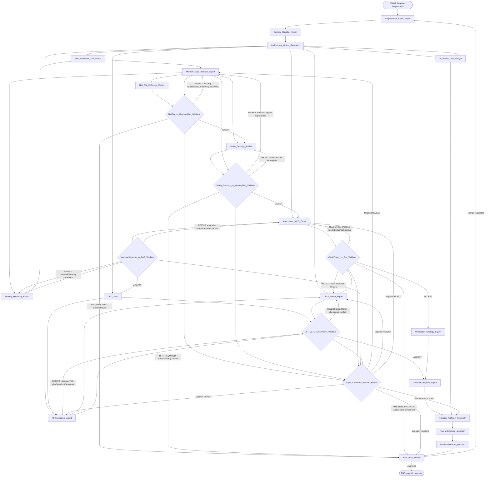

# Agent 1 V3.0 Super Committee Plan — Hardware Architecture Council

> Scope: planning only. No production code change in this document.
> Role: Principal System Architect design review.
> Goal: upgrade Agent 1 from current 8-node hierarchical planner into a 16+ node commercial chip architecture committee with mandatory cross-validation feedback loops.

## 1. Executive Summary

Agent 1 currently behaves as a hierarchical planning layer with 8 micro-experts, mandatory Codex evidence, tool-backed PPA/bandwidth numbers, strict APB pinout, Mermaid output, and final schema compatibility for Agent 2.

V3.0 expands this into a hardware architecture council covering chip planning concerns that normally appear before RTL signoff:

- hardware/software contract,
- physical IO/package/power pins,
- power intent and CDC,
- bus arbitration/QoS/deadlock,
- memory hierarchy latency/bandwidth,
- DFT/production test,
- safety/security,
- IP reuse/cost/die-size tradeoff.

V3.0 must not run straight-line only. It must include validation nodes that read peer artifacts and can reject a prior node output through conditional LangGraph edges.

## 2. Current System Survey

### 2.1 Files surveyed

- `docs/semiconductor_swarm_ai.md`
- `docs/AGENT1_UPGRADE_TASKS.md`
- `semiconductor_swarm/agents/agent1_planning/agent1_subgraph.py`
- `semiconductor_swarm/agents/agent1_planning/architect.py`
- `semiconductor_swarm/agents/agent1_planning/agent1_prompt.py`
- `semiconductor_swarm/agents/agent1_planning/agent1_config.py`
- `tests/test_agent1.py`
- `tests/test_prompt_contracts.py`

### 2.2 Current Agent 1 architecture

Current `MICRO_EXPERTS` list has 8 nodes:

1. `Requirement Intake Expert`
2. `Domain Classifier Expert`
3. `Architecture Option Generator`
4. `PPA/Bandwidth Tool Expert`
5. `Memory Map & Interface Expert`
6. `Verification Strategy Expert`
7. `Mermaid Diagram Expert`
8. `Principal Architect Reviewer`

Current generated artifacts:

- `agent1_codex_response.md`
- `agent1_codex_evidence.json`
- `agent1_intake.json`
- `agent1_domain_classification.json`
- `agent1_architecture_options.md`
- `agent1_tool_evidence.json`
- `agent1_memory_interface_plan.json`
- `agent1_verification_strategy.md`
- `agent1_review_scorecard.md`
- `agent1_micro_expert_validation.json`

### 2.3 Current strengths to preserve

- Codex model evidence is mandatory: `cx/gpt-5.5` through OpenAI-compatible endpoint `http://localhost:20128/v1`.
- No silent fallback when Codex unavailable.
- PPA and bandwidth remain deterministic tool calls.
- APB slave pinout remains single source of truth.
- Agent 2 contract remains stable.
- Mermaid diagram requirement already exists.
- HITL plan review remains first checkpoint before RTL.

### 2.4 Current gaps V3 must fix

- Current flow is mostly linear Python function, not full conditional feedback LangGraph subgraph.
- Validation checks only artifact/schema presence; no peer cross-check matrix.
- No HAL/firmware interrupt semantics.
- No package pinout/VDD/GND/ESD planning.
- No UPF/power-domain/CDC review.
- No bus QoS/deadlock review.
- No SRAM/cache latency and bandwidth hierarchy modeling.
- No DFT/JTAG/scan/MBIST planning.
- No ISO 26262/security register protection review.
- No die-size/IP-reuse/cost analysis.

## 3. V3.0 Target Node Inventory

V3.0 keeps current 8 nodes and adds 8 new domain experts plus 4 explicit validation/router nodes. Minimum deployable graph has 20 nodes.

### 3.1 Existing 8 nodes retained

| ID | Node | Responsibility | Output |
|---|---|---|---|
| E01 | `Requirement_Intake_Expert` | Normalize Vietnamese/English requirement, extract must/should/could/unknown constraints. | `agent1_intake.json` |
| E02 | `Domain_Classifier_Expert` | Classify project domain and ambiguity risk. | `agent1_domain_classification.json` |
| E03 | `Architecture_Option_Generator` | Generate 2-3 candidate architectures and tradeoffs. | `agent1_architecture_options.md` |
| E04 | `PPA_Bandwidth_Tool_Expert` | Call `calculate_ppa()` and `calculate_bandwidth()` only; forbid mental math. | `agent1_tool_evidence.json` |
| E05 | `Memory_Map_Interface_Expert` | Define memory map, APB pinout, register ownership, reset/clock naming. | `agent1_memory_interface_plan.json` |
| E06 | `Verification_Strategy_Expert` | Formal-first properties, DV scenario matrix, coverage/signoff risks. | `agent1_verification_strategy.md` |
| E07 | `Mermaid_Diagram_Expert` | Generate block/lifecycle/subgraph diagrams, no ASCII block diagram. | Mermaid sections in `architecture_plan.md` |
| E08 | `Principal_Architect_Reviewer` | Reconcile all artifacts, select architecture, enforce schema compatibility. | `agent1_review_scorecard.md`, final spec |

### 3.2 New 8 experts required

| ID | New Node | Purpose | Mandatory Output | Downstream impact |
|---|---|---|---|---|
| N01 | `HW_SW_CoDesign_Expert` | Define HAL, firmware-visible register semantics, interrupt handling flow, boot/config sequence. | `agent1_hw_sw_codesign_plan.json` | Agent 2 register semantics, Agent 3 interrupt tests, firmware docs |
| N02 | `IO_Packaging_Expert` | Define physical pinout, VDD/GND pins, reset/clock pins, IO standards, ESD assumptions. | `agent1_io_packaging_plan.json` | Agent 4 constraints/QSF/SDC, future ASIC pad ring |
| N03 | `Clock_Power_Expert` | Define power domains, clock domains, reset domains, UPF intent, CDC/RDC requirements. | `agent1_clock_power_plan.json` | Agent 2 CDC wrappers, Agent 5 CDC assertions, Agent 4 constraints |
| N04 | `Interconnect_QoS_Expert` | Define bus arbitration, priorities, ordering, timeout policy, deadlock/livelock avoidance. | `agent1_interconnect_qos_plan.json` | APB/AXI fabric RTL, formal deadlock checks |
| N05 | `Memory_Hierarchy_Expert` | Define SRAM/cache hierarchy, latency/bandwidth budgets, DMA access paths, contention model. | `agent1_memory_hierarchy_plan.json` | Memory RTL, DMA, DV bandwidth tests |
| N06 | `DFT_Lead` | Propose JTAG, scan-chain, MBIST/LBIST hooks, test modes, boundary scan strategy. | `agent1_dft_plan.json` | RTL test mode ports, FPGA/ASIC constraints |
| N07 | `Safety_Security_Analyst` | Assess ISO 26262 risk, security threats, privilege/lock/write-once/keyed register protection. | `agent1_safety_security_plan.json` | Register map protection, formal security properties |
| N08 | `IP_Reuse_Cost_Analyst` | Assess die area/cost, IP reuse, buy/build choice, complexity risk, license constraints. | `agent1_ip_reuse_cost_plan.json` | Architecture choice, scope control, PPA/cost tradeoff |

### 3.3 New validation/router nodes required

| ID | Validation Node | Reads | Can reject to | Required trigger |
|---|---|---|---|---|
| V01 | `Safety_Security_vs_MemoryMap_Validator` | `agent1_memory_interface_plan.json`, `agent1_safety_security_plan.json` | `Memory_Map_Interface_Expert` and/or `Safety_Security_Analyst` | Sensitive register lacks protection, privilege, lock, write-one-to-clear correctness, write-once, or secure reset value. |
| V02 | `HWSW_vs_RegisterMap_Validator` | `agent1_memory_interface_plan.json`, `agent1_hw_sw_codesign_plan.json` | `Memory_Map_Interface_Expert` and/or `HW_SW_CoDesign_Expert` | Missing interrupt clear/status/mask/enable register, no W1C semantics, missing firmware-visible reset defaults. |
| V03 | `ClockPower_vs_Bus_Validator` | `agent1_clock_power_plan.json`, `agent1_interconnect_qos_plan.json`, bus topology | `Clock_Power_Expert` and/or `Interconnect_QoS_Expert` | Two IPs on different clocks have no CDC bridge, async FIFO, synchronizer, or reset crossing plan. |
| V04 | `Super_Committee_Review_Router` | all validation decisions | exact target node or HITL | Route ACCEPT to next phase; route REJECT to repair node; route too many loops to HITL. |

## 4. Cross-Validation Matrix

### 4.1 Decision object contract

Every validation node must emit strict JSON:

```json
{
  "validator": "Safety_Security_vs_MemoryMap_Validator",
  "decision": "ACCEPT | REJECT | HITL_REQUIRED",
  "target_node": "Memory_Map_Interface_Expert | Safety_Security_Analyst | ... | null",
  "severity": "INFO | WARNING | BLOCKER",
  "findings": [
    {
      "id": "SEC_REG_001",
      "artifact": "agent1_memory_interface_plan.json",
      "field": "memory_map.control_regs.security_key",
      "problem": "Sensitive register is writable without lock/privilege/key protection.",
      "required_change": "Mark register as privileged, write-once after lock, reset secure default, add lock bit."
    }
  ],
  "revision": 1,
  "max_revisions": 3
}
```

Router rules:

- `ACCEPT`: continue to next node.
- `REJECT`: route to `target_node` with `required_change` list.
- `HITL_REQUIRED`: pause workflow and write human-readable review packet.
- If same validator rejects same target more than `max_revisions`, force HITL.

### 4.2 Cross-Check A — Safety/Security vs Memory Map

Mandatory behavior:

- `Safety_Security_Analyst` must read memory map draft from `Memory_Map_Interface_Expert`.
- Validator scans registers marked or inferred as sensitive:
  - control registers changing clocks/power/reset,
  - DMA base/limit registers,
  - interrupt mask/enable if safety-critical,
  - debug/JTAG unlock registers,
  - cryptographic/security keys if present,
  - boot/config mode registers.
- Reject if any sensitive register lacks at least one appropriate protection control:
  - privilege requirement,
  - write-once semantics,
  - lock bit,
  - keyed unlock,
  - reserved-bit mask,
  - safe reset default,
  - formal property requirement.

Reject route:

```text
Safety_Security_vs_MemoryMap_Validator --REJECT--> Memory_Map_Interface_Expert
Memory_Map_Interface_Expert --revised register map--> Safety_Security_vs_MemoryMap_Validator
```

### 4.3 Cross-Check B — HW/SW CoDesign vs Register Map

Mandatory behavior:

- `HW_SW_CoDesign_Expert` must read draft register map.
- It validates firmware can configure, use, and recover device.
- Reject if:
  - interrupt source has no status bit,
  - interrupt source has no enable/mask bit,
  - interrupt status has no clear behavior,
  - clear behavior is not explicit W1C or read-clear,
  - error status has no software recovery path,
  - register reset default missing,
  - HAL sequence cannot be expressed deterministically.

Reject route:

```text
HWSW_vs_RegisterMap_Validator --REJECT--> Memory_Map_Interface_Expert
Memory_Map_Interface_Expert --revised register map--> HW_SW_CoDesign_Expert
HW_SW_CoDesign_Expert --revised HAL plan--> HWSW_vs_RegisterMap_Validator
```

### 4.4 Cross-Check C — Clock/Power vs Bus Architecture

Mandatory behavior:

- `Clock_Power_Expert` must read bus topology from `Interconnect_QoS_Expert` and `Architecture_Option_Generator`.
- It checks every master/slave pair clock relationship.
- Reject if:
  - source and destination clocks differ and no CDC bridge exists,
  - interrupt crosses clock domain without 2FF synchronizer or pulse stretcher,
  - DMA data path crosses domains without async FIFO/handshake,
  - reset domain crossing not specified,
  - power-domain crossing lacks isolation/level-shifter/retention rule,
  - UPF intent absent for multi-power-domain architecture.

Reject route:

```text
ClockPower_vs_Bus_Validator --REJECT--> Clock_Power_Expert
ClockPower_vs_Bus_Validator --REJECT--> Interconnect_QoS_Expert
Clock_Power_Expert + Interconnect_QoS_Expert --revised CDC/bus plan--> ClockPower_vs_Bus_Validator
```

## 5. Detailed Mermaid LangGraph Design



## 6. Proposed V3 Artifact Set

Existing artifacts remain. New artifacts:

- `agent1_hw_sw_codesign_plan.json`
- `agent1_io_packaging_plan.json`
- `agent1_clock_power_plan.json`
- `agent1_interconnect_qos_plan.json`
- `agent1_memory_hierarchy_plan.json`
- `agent1_dft_plan.json`
- `agent1_safety_security_plan.json`
- `agent1_ip_reuse_cost_plan.json`
- `agent1_cross_validation_matrix.json`
- `agent1_validation_decisions.json`
- `agent1_revision_history.json`
- `agent1_v3_super_committee_report.md`

## 7. Final Spec Schema Extensions

V3 must preserve all existing top-level fields expected by Agent 2:

```json
{
  "project_name": "...",
  "target_node": "...",
  "isa": "...",
  "core_config": {},
  "accelerator": {},
  "ppa_estimate": {},
  "bandwidth_estimate": {},
  "memory_map": {},
  "bus_topology": {},
  "ip_blocks": [],
  "clock_domains": [],
  "constraints": {},
  "interfaces": {}
}
```

Add optional V3 sections without breaking Agent 2:

```json
{
  "firmware_contract": {
    "hal_modules": [],
    "interrupt_flow": [],
    "register_access_semantics": {}
  },
  "io_packaging": {
    "pins": [],
    "power_pins": [],
    "ground_pins": [],
    "esd_assumptions": []
  },
  "power_intent": {
    "power_domains": [],
    "upf_required": false,
    "isolation_rules": [],
    "retention_rules": []
  },
  "cdc_rdc_plan": {
    "clock_crossings": [],
    "reset_crossings": [],
    "required_cells": []
  },
  "interconnect_qos": {
    "arbitration": "fixed_priority | round_robin | weighted_rr",
    "priority_map": {},
    "timeout_policy": {},
    "deadlock_avoidance": []
  },
  "memory_hierarchy": {
    "levels": [],
    "latency_budget_cycles": {},
    "bandwidth_budget_mb_s": {}
  },
  "dft_plan": {
    "jtag": {},
    "scan_chains": [],
    "mbist": [],
    "test_modes": []
  },
  "safety_security": {
    "iso26262_assumptions": [],
    "threat_model": [],
    "protected_registers": []
  },
  "ip_reuse_cost": {
    "reuse_candidates": [],
    "buy_vs_build": [],
    "die_area_risk": "low | medium | high"
  }
}
```

## 8. LangGraph State Design

Proposed state object:

```python
class Agent1V3State(TypedDict):
    requirement: str
    project_name: str
    codex_evidence: dict[str, Any]
    artifacts: dict[str, str]
    spec_draft: dict[str, Any]
    validation_decisions: list[dict[str, Any]]
    revision_counts: dict[str, int]
    next_node: str | None
    hitl_required: bool
    errors: list[str]
```

Conditional edge function:

```python
def route_validation_decision(state: Agent1V3State) -> str:
    decision = state["validation_decisions"][-1]
    if decision["decision"] == "ACCEPT":
        return "next"
    if decision["decision"] == "HITL_REQUIRED":
        return "hitl_plan_review"
    target = decision["target_node"]
    if state["revision_counts"].get(target, 0) >= decision.get("max_revisions", 3):
        return "hitl_plan_review"
    return target
```

## 9. Prompt Upgrade Requirements

`AGENT1_SYSTEM_PROMPT` must be expanded to include:

- 16 expert node roles,
- strict no-math rule,
- mandatory tool calls for PPA/bandwidth,
- mandatory peer artifact reads,
- mandatory cross-validation matrix,
- strict reject/accept JSON contract,
- final spec compatibility contract,
- no downstream breakage rule,
- HITL escalation after repeated validation failure.

## 10. Test Plan

Add or update tests after plan approval:

1. `test_agent1_v3_micro_experts_count`
   - Assert base experts + new experts + validation nodes present.
2. `test_agent1_v3_artifacts_present`
   - Assert all new artifact names generated.
3. `test_safety_security_rejects_unprotected_sensitive_register`
   - Feed memory map with DMA base register unprotected; expect REJECT to Memory Map.
4. `test_hwsw_rejects_missing_interrupt_clear`
   - Feed interrupt status without W1C clear; expect REJECT to Memory Map.
5. `test_clock_power_rejects_missing_cdc`
   - Feed two clock domains with direct bus crossing; expect REJECT to Clock/Power or QoS.
6. `test_revision_limit_routes_to_hitl`
   - Force repeated reject; expect HITL.
7. `test_agent2_schema_backward_compatible`
   - Existing mandatory fields unchanged.
8. `test_v3_mermaid_has_feedback_loops`
   - Check Mermaid contains REJECT loop labels and validation diamond nodes.
9. `test_no_llm_numeric_estimates`
   - PPA/bandwidth still from deterministic tools.

## 11. Migration Plan

### Phase 0 — This planning document

- Create `docs/AGENT1_V3_SUPER_COMMITTEE_PLAN.md` only.
- No production code changes.
- Human reviews Mermaid and cross-validation design.

### Phase 1 — Contracts and constants

- Add expert lists and artifact names.
- Extend prompt.
- Add test skeletons.

### Phase 2 — State/artifact expansion

- Add `Agent1V3State`.
- Add artifact builder functions for 8 new experts.
- Keep current final spec generator compatible.

### Phase 3 — Validators

- Implement three mandatory cross-check validators first:
  - Safety/Security vs Memory Map,
  - HW/SW vs Register Map,
  - Clock/Power vs Bus.
- Add optional DFT/memory/QoS validators after mandatory validators pass.

### Phase 4 — LangGraph conditional subgraph

- Replace linear internal Agent 1 flow with conditional graph.
- Parent `swarm_graph.py` still calls one Agent 1 entrypoint.
- Preserve HITL pause before Agent 2.

### Phase 5 — UAT

- Re-run partial Agent 1:
  - `python debug_runners\run_partial.py "Thiết kế bộ đếm Counter 8-bit có tín hiệu Reset" --stop-after agent1 ...`
- Assert no RTL generated.
- Assert new artifacts present.
- Assert Mermaid feedback loops present.

## 12. Acceptance Criteria

V3 accepted only if:

- 16+ expert nodes exist in Agent 1 V3 design.
- 3 mandatory cross-checks exist and can produce `REJECT`.
- Rejection routes back to exact repair node, not generic retry.
- Repeated rejections route to HITL.
- `architecture_plan.md` includes detailed Mermaid with feedback loops.
- Existing Agent 2 spec fields remain unchanged.
- PPA/bandwidth still tool-backed.
- Codex evidence remains mandatory.
- No production code generated before plan approval.

## 13. Risks and Controls

| Risk | Impact | Control |
|---|---|---|
| Graph becomes too complex | hard debug | strict state schema and per-validator unit tests |
| Validators over-reject simple designs | false blocking | severity levels and project complexity gating |
| Agent 2 breaks due schema changes | pipeline fail | optional V3 sections only; keep existing fields stable |
| LLM invents numeric values | wrong PPA | keep deterministic tools mandatory |
| Infinite feedback loop | stuck workflow | revision limit and HITL route |
| Mermaid too large for review | unreadable | split into overview + validation detail diagrams if needed |

## 14. Immediate Next Step After Approval

If human approves this plan, implementation should start with test-first changes:

1. Add V3 expert constants and validation decision schema tests.
2. Implement pure validation functions without LLM.
3. Add new artifact generators.
4. Convert internal Agent 1 flow to conditional LangGraph.
5. Run UAT partial stop-after-agent1 before any Agent 2 run.
